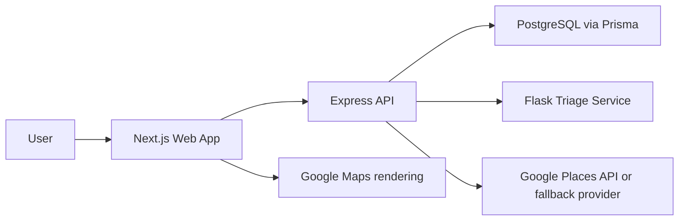

# AI-Powered Healthcare Diagnosis Assistant

A production-oriented clinical pre-diagnosis support system and specialty-based hospital recommendation platform.

This project is not an AI doctor and does not replace professional diagnosis. It is a medical triage and guidance assistant that helps users understand possible causes, safer first steps, urgency, specialist fit, and medically relevant nearby hospitals.

## What It Answers

- What issue might I be facing?
- Can I manage this safely for now?
- Do I need medical attention?
- Which doctor should I consult?
- Which nearby hospital should I visit?

## Architecture



## Tech Stack

- Frontend: Next.js, TypeScript, Tailwind CSS, Axios, React Hook Form
- Backend: Node.js, Express.js, JWT auth, Prisma
- Database: PostgreSQL
- AI Layer: Flask rule-based triage microservice
- Maps: Google Places API with specialty-aware fallback data

## Project Structure

```text
apps/web        Next.js clinical assistant UI
apps/api        Express API, auth, persistence, hospital search
services/triage Flask symptom analysis microservice
docs            Product, safety, and deployment notes
```

## Quick Start

1. Install JavaScript dependencies:

```bash
npm install
```

2. Create environment files:

```bash
cp .env.example .env
cp apps/web/.env.example apps/web/.env.local
cp apps/api/.env.example apps/api/.env
cp services/triage/.env.example services/triage/.env
```

3. Start Postgres:

```bash
docker compose up -d postgres
```

4. Prepare the database:

```bash
npm run db:generate
npm run db:migrate
```

5. Start the Python triage service:

```bash
cd services/triage
python -m venv .venv
.venv\bin\pip install -r requirements.txt
.venv\bin\python -m flask --app app.main run --port 8001
```

6. Start the web and API apps:

```bash
npm run dev
```

The web app runs at `http://localhost:3000`, the Express API at `http://localhost:4000`, and the triage service at `http://localhost:8001`.

## Safety Model

The triage service intentionally uses explainable rules instead of opaque diagnosis. It classifies urgency as:

- Mild
- Moderate
- Urgent
- Emergency

Emergency red flags always override lower classifications and trigger immediate-care language plus emergency-relevant specialists and hospitals.

## Hospital Recommendation Logic

The system never searches for all hospitals blindly. It maps triage output to a specialist and searches with a specialty-aware query such as:

- `cardiology hospitals near me`
- `neurology hospitals near me`
- `women and child hospitals near me`
- `dental hospitals near me`

If Google Places credentials are not configured, the backend returns clearly marked fallback facilities so the application remains testable in development.

## Deployment

- Frontend: Vercel
- Backend: Render, Railway, AWS, or Fly.io
- Triage service: Render, Railway, AWS, or Fly.io
- Database: Supabase or Neon PostgreSQL

See [docs/DEPLOYMENT.md](docs/DEPLOYMENT.md) for service-specific settings.
